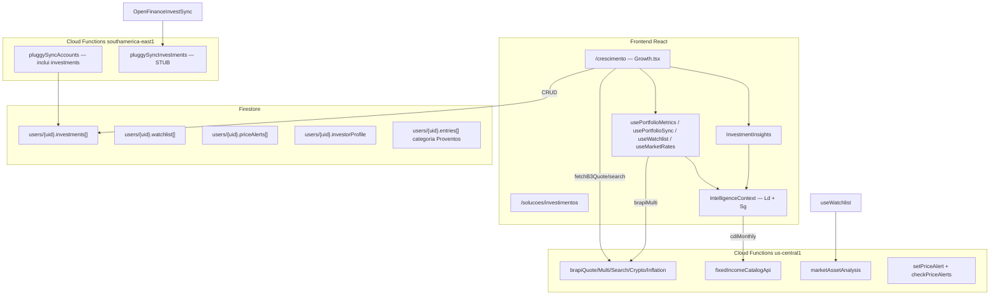

# Auditoria do Módulo de Investimentos — Sibanki

**Data:** 27/06/2026  
**Origem:** Relatório gerado por auditoria de código (frontend, backend, dados, UX, IA).

---

# Auditoria completa — Módulo de Investimentos (Sibanki)

**Data:** 27/06/2026  
**Escopo:** Frontend, backend, dados, UX, IA, gaps e recomendações

## Resumo executivo

O módulo de investimentos do Sibanki concentra-se na rota **`/crescimento`** (`Growth.tsx`, ~1.454 linhas), com sub-abas para carteira, análise B3, watchlist, cripto (embed), simuladores, perfil de investidor e Open Finance. Os dados vivem no array **`users/{uid}.investments[]`** no Firestore (path legado em produção), não em subcoleção multi-tenant como alguns docs descrevem.

A stack está madura em **cotações B3 (BRAPI)**, **renda fixa (BCB + Tesouro)**, **motores Ld/Sg** (`sovereigntyEngine.ts`) e **Raio X da carteira** (`usePortfolioMetrics` + `InvestmentInsights`). Há evolução recente (jun/2026): sync de cotações em batch, watchlist com Graham/Bazin, alertas de preço, rebalanceamento por perfil.

Os maiores gaps são: **Cripto desconectada da carteira real** (demo + CoinGecko direto no browser), **UI/documentação inconsistentes sobre Open Finance de investimentos** (Pluggy já sincroniza via `pluggySyncAccounts`, mas a aba dedicada e `pluggySyncInvestments` ainda são stub), **Growth.tsx monolítico**, **dashboards Raio-X temáticos só como tipos TypeScript** (sem componentes), e **documentação desatualizada** (`docs/INVESTIMENTOS-COMPLETO.md` vs código).

---

## Arquitetura

---

## Inventário de arquivos-chave

| Camada | Path | Papel |
|--------|------|-------|
| **Rota principal** | `src/pages/Growth.tsx` | Hub único do módulo (7 abas) |
| **Cripto (embed)** | `src/pages/Cripto.tsx` | Mercado CoinGecko + carteira demo; sem rota própria em `App.tsx` |
| **Parceiros** | `src/pages/solutions/SolucaoInvestimentosParceiros.tsx` | Vitrine afiliados (não é carteira) |
| **IR (placeholder)** | `src/pages/RelatorioIR.tsx` | "Em construção" |
| **Tipos** | `src/types/userData.ts` | `Investment`, `InvestorProfile`, `WatchlistItem`, `PriceAlert`, `OpenFinanceInvestment` |
| **Raio-X dashboards (tipos only)** | `src/types/raioXDashboards.ts` | Props ETF/RF/Cripto — **sem componentes** |
| **Persistência** | `src/services/persistUserData.ts` | `add/update/deleteInvestment` |
| **Validação** | `src/services/validators.ts` | `validateInvestment` |
| **BRAPI cliente** | `src/services/brapi.ts` | Cache 2 min, `fetchB3Quote`, `searchB3Tickers` |
| **Motores** | `src/utils/sovereigntyEngine.ts` | Ld, Sg, Graham, Bazin, Solidez, `calculateInvestorProfile` |
| **Métricas carteira** | `src/hooks/usePortfolioMetrics.ts` | Rentabilidade, FIRE, rebalanceamento, IR estimado |
| **Sync cotações** | `src/hooks/usePortfolioSync.ts` | Batch `brapiMulti` → atualiza `atual`/`dy` |
| **Taxas mercado** | `src/hooks/useMarketRates.ts` | CDI/Selic/IPCA via `fixedIncomeCatalogApi` |
| **Watchlist** | `src/hooks/useWatchlist.ts` | CRUD + `marketAssetAnalysis` |
| **Alertas** | `src/hooks/usePriceAlerts.ts` | CRUD em `priceAlerts[]` |
| **Raio X UI** | `src/components/ui/InvestmentInsights.tsx` | Card principal; usa Ld canônico do `IntelligenceContext` |
| **Componentes v2** | `src/components/investment/` | 9 arquivos (sync bar, rebalance, IR, watchlist, etc.) |
| **Charts** | `src/components/charts/` | `PortfolioChart`, `ProventosBarChart`, `PriceChart` |
| **Contexto IA** | `src/utils/consultantContext.ts` | Resumo investimentos + Ld/Sg para consultor |
| **Intelligence** | `src/context/IntelligenceContext.tsx` | `calculateDaysOfFreedom` + `calculateSpreadGap` |
| **Backend BRAPI** | `functions/services/market/brapiService.js` | Quote/multi/search/crypto/inflation + cache |
| **Rate limit** | `functions/services/market/brapiRateLimiter.js` | 30 req/min/uid |
| **Renda fixa** | `functions/services/market/fixedIncomeService.js` | BCB SGS + Tesouro + fallback CSV |
| **Consultor** | `functions/services/assistant/assistantOrchestrator.js` | Raio-X determinístico: ações, ETF/FII, cripto, RF |
| **Pluggy invest** | `functions/services/pluggy/pluggySyncService.js` | Merge em `investments[]` no sync geral |
| **Docs** | `docs/INVESTIMENTOS-COMPLETO.md`, etc. | Parcialmente desatualizados |
| **Testes** | `src/utils/sovereigntyEngine.test.ts`, `src/services/validators.test.ts`, `functions/tests/brapiRateLimiter.test.js` | Motor + validação + rate limit; **sem E2E `/crescimento`** |

**Rotas:** `/crescimento` → Growth; `/solucoes/investimentos` → parceiros; `/relatorio-ir` → placeholder. **Não existe** `/cripto` — Cripto só como aba dentro de Growth.

---

## Análise por camada

### UI / UX / Design

**Fluxo principal (aba "Minha Carteira"):**
1. `InvestmentInsights` — Raio X (rentabilidade vs CDI, renda passiva, Ld, FIRE, alinhamento de perfil)
2. `PortfolioSyncBar` — botão "Atualizar cotações" (B3)
3. KPIs (aplicado, atual, P&L, renda passiva)
4. `PortfolioChart` + `PortfolioEvolutionChart`
5. `BenchmarkPanel` + `RebalancingPanel`
6. `IrPanel` (IR estimado simplificado)
7. `PortfolioListItem` expandível com `PriceChart` inline

**Outras abas:** Análise B3, Watchlist, Cripto (demo), Simuladores, Perfil investidor, OF Investimentos (stub UI).

**Design Pierre:** parcialmente aderente. Drift em Cripto e InvestmentInsights (cores hardcoded).

### Modelo de dados

- `Investment` em `users/{uid}.investments[]` (array inline, IDs numéricos)
- Validators wired em persistUserData
- Firestore rules **sem** schema validation de investments[]
- Fallback renda passiva inconsistente: 0,5% a.m. (`usePortfolioMetrics`) vs 1% a.m. (`sovereigntyEngine`)

### Backend / APIs

| Callable | Região | Função |
|----------|--------|--------|
| `brapiQuote/Search/Multi/Crypto/Inflation` | us-central1 | Proxy BRAPI |
| `fixedIncomeCatalogApi` | us-central1 | Selic, IPCA, Tesouro |
| `marketAssetAnalysis` | us-central1 | Cotação + fundamentais + RSI |
| `setPriceAlert` / `checkPriceAlerts` | us-central1 | Alertas preço |
| `pluggySyncAccounts` | southamerica-east1 | **Já importa investimentos** |
| `pluggySyncInvestments` | southamerica-east1 | **STUB** |

### Lógica de negócio

Perfil investidor, rebalanceamento, FIRE (4%), proventos manuais, IR estimado simplificado, alocação por tipo.

---

## Pontos fortes

1. Métricas centralizadas (`usePortfolioMetrics`)
2. Motor soberano testado (`sovereigntyEngine.test.ts`)
3. Mercado real (CDI/Selic dinâmicos, BRAPI, renda fixa BCB+Tesouro)
4. Cadastro RV com autocomplete e telemetria
5. Consultor Raio-X determinístico
6. Watchlist + alertas de preço
7. Ld unificado no Raio X com IntelligenceContext

---

## Problemas e gaps

| Severidade | Problema |
|------------|----------|
| **Crítico** | Cripto não integrada à carteira Firestore (DEMO_PORTFOLIO) |
| **Crítico** | Documentação enganosa sobre persistência (subcoleção vs array) |
| **Alto** | Growth.tsx monolítico (~1.454 linhas) |
| **Alto** | Open Finance investimentos — UI "em breve" vs sync real no Pluggy |
| **Alto** | Dashboards Raio-X temáticos inexistentes (só tipos) |
| **Médio** | Fallback renda passiva inconsistente |
| **Médio** | `usePortfolioSync` pode corromper estado (array stale) |
| **Médio** | CDI fixo 10,5% no formulário RF |
| **Médio** | Relatório IR placeholder |
| **Baixo** | InvestorProfileForm.tsx órfão, testes E2E ausentes |

---

## Comparação: INVESTIMENTOS-COMPLETO.md vs código

| Doc afirma | Código real |
|------------|-------------|
| Subcoleção `/tenants/.../investments` | Array `users/{uid}.investments[]` |
| Validação Firestore de `tipo` | Sem schema validation |
| Fallback 1% a.m. no motor | UI Raio X usa 0,5% em usePortfolioMetrics |

---

## Recomendações priorizadas

### Crítico
1. Unificar Cripto com `investments[]`
2. Alinhar narrativa Open Finance à sync real do Pluggy
3. Atualizar `docs/INVESTIMENTOS-COMPLETO.md`

### Próximo sprint
4. Quebrar `Growth.tsx` em componentes/abas
5. Alinhar fallbacks de renda passiva
6. Fix `usePortfolioSync` (batch único)
7. CDI dinâmico no cadastro RF
8. Smoke Playwright `/crescimento`

### Médio prazo
9. Implementar dashboards Raio-X ou remover tipos mortos
10. Relatório IR real
11. Decomposição retorno (valorização vs proventos)
12. Push nos alertas de preço
13. Validação Firestore para investments[]
14. Consolidar perfil investidor

### Quick wins
- Deletar ou usar `InvestorProfileForm.tsx`
- Adicionar `cdiMonthly` às deps do spread em IntelligenceContext
- Link Growth → `/solucoes/investimentos`

---

## Conclusão

O módulo é um dos mais completos do Sibanki em inteligência financeira, mas sofre de fragmentação UX (Cripto vs Growth), documentação defasada e dívida estrutural (Growth monolítico, features "coming soon" parcialmente existentes no backend). Priorizar integração Cripto + honestidade Open Finance + refactor de Growth.
