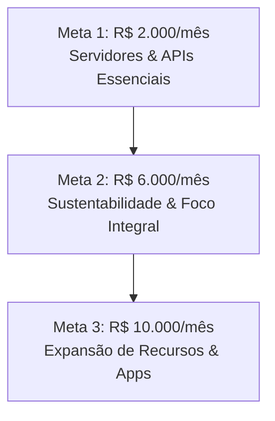

# Campanha de Financiamento Coletivo Recorrente — Sibanki (Benfeitoria)

Este documento contém o material completo de texto, metas e recompensas mensais para a campanha do **Sibanki** na modalidade **Benfeitoria Recorrente** (assinatura/financiamento mensal).

---

## 📌 1. Informações Básicas da Campanha (Recorrente)

* **Título da Campanha (Máx. 50 caracteres):**
  `Sibanki: O Sistema Operacional da sua Liberdade`
* **Frase de Efeito / Pitch Curto (Máx. 140 caracteres):**
  `Apoie o primeiro Financial OS independente do Brasil. Conquiste sua soberania financeira com IA, Open Finance e sem anúncios.`
* **Categoria:** Tecnologia / Finanças Pessoais / Impacto Social
* **Objetivo da Arrecadação (O que será feito com o dinheiro - Simples e Direto):**
  `O dinheiro arrecadado será usado para manter o Sibanki online, seguro e livre de anúncios. Os recursos cobrem os custos mensais de servidores de banco de dados, a integração segura de Open Finance com as contas bancárias dos usuários e o processamento de Inteligência Artificial do consultor financeiro. Além disso, o valor viabiliza a dedicação integral do criador no desenvolvimento de novos recursos, correção de bugs e suporte direto aos apoiadores.`

---

## 📖 2. Quem Somos e no Que Acreditamos (Apresentação Profunda)

*(Copie e cole na descrição principal da campanha. Este texto foi expandido para detalhar nossa tese de produto contra o mercado tradicional).*

### O modelo atual de controle financeiro está quebrado.

A maioria das pessoas vive sob o peso do estresse financeiro. Os bancos querem que você pegue crédito; os aplicativos de controle de gastos tradicionais querem que você se sinta culpado. Eles te mostram gráficos coloridos, alertas vermelhos de *"você estourou seu limite de café"* e enchem sua tela de anúncios de cartões e empréstimos que você não precisa (porque o modelo de negócios deles é vender os seus dados).

Nós acreditamos que **o controle financeiro baseado na culpa não funciona**. Ele gera ansiedade, não soberania.

O **Sibanki** nasceu de uma tese diferente: **dinheiro não é papel, dinheiro é tempo**. Você não trabalha por reais; você troca horas da sua vida por um recurso. Logo, a gestão do seu dinheiro deve ser focada em comprar o seu tempo de volta.

Não somos uma planilha digitalizada. Somos um **Financial OS (Sistema Operacional Financeiro)** independente, focado em dar clareza matemática e soberania de decisão para você.

---

### 🛡️ O Motor de Soberania: Nossos 3 Indicadores Proprietários

Para materializar essa filosofia, criamos três engines matemáticas que analisam sua vida financeira sob uma nova perspectiva:

#### 1. Ld (Dias de Liberdade) — A Verdadeira Métrica da Riqueza
A riqueza não é medida pelo tamanho do seu saldo, mas por quanto tempo você sobrevive sem trabalhar. Se você tem R$ 10.000 guardados e gasta R$ 5.000 por mês, você tem **60 Dias de Liberdade**. Se você otimiza seus custos para R$ 2.500 por mês, você instantaneamente duplicou sua riqueza em tempo (**120 Dias de Liberdade**), sem precisar ganhar um único centavo a mais. O Sibanki calcula o seu Ld dinamicamente, cruzando seu patrimônio líquido com o seu *Burn Rate* real dos últimos 90 dias.

#### 2. Sg (Spread Gap) — O Combate ao Vazamento Invisível
Os bancos ganham bilhões operando no "spread": eles captam o seu dinheiro pagando 1% ao mês e te cobram 12% ao mês no cheque especial ou cartão. O *Spread Gap* é a diferença entre a taxa média que seus investimentos rendem e o custo médio dos seus passivos. O Sibanki expõe essa assimetria cruel e calcula o seu "Vazamento Mensal" em reais. Nós te mostramos exatamente quanto dinheiro está escapando da sua carteira para o lucro dos emissores de crédito.

#### 3. Sv (Sovereignty Score) — O Seu Voto Diário
Cada compra que você faz é um voto. Um voto para comprar mais liberdade (investimentos, ativos) ou um voto para vender o seu tempo futuro (passivos, parcelamentos longos). O *Sovereignty Score* avalia cada transação individualmente (de 0 a 100) baseando-se no método de pagamento, liquidez do ativo, timing da compra e categoria, ajudando você a enxergar se aquele gasto aumenta ou drena sua autonomia.

---

### 🤖 Inteligência Artificial sem Intermediação Comercial

O Sibanki integra um **Consultor de IA Multimodal** privado. Ele tem contexto completo do seu perfil (via sincronização segura de **Open Finance** com a API da Pluggy). 
* Você pode mandar uma foto de uma nota fiscal ou um áudio de voz descrevendo um gasto: a IA processa, extrai as informações e lança no sistema.
* Você pode perguntar sobre estratégias de decisão em tempo real: *"Com juros do CDI em X%, vale a pena amortizar minha dívida Y ou investir o dinheiro?"*. O consultor roda simulações matemáticas puras, sem te empurrar produtos de parceiros com conflito de interesses.

---

### 🎨 Pierre Finance: O Manifesto Monocromático
Você já reparou que apps de finanças são cheios de cores estimulantes? Verde para "compre", vermelho para "pare", gradientes piscando. Isso é psicologia de consumo para te manter ativo na tela. 

O Sibanki adota o design system **Pierre Finance**: uma interface estritamente monocromática (tons de preto `#0a0a0a`, cards `#111111` e tipografia branca/cinza). Sem cores desnecessárias, sem botões coloridos chamativos, sem distrações. Apenas dados puros, limpos e elegantes. É um manifesto visual de que o seu dinheiro é um assunto sério e racional.

---

## 🎯 3. As Metas Mensais de Manutenção

Como somos um projeto independente — que **nunca venderá seus dados de consumo para terceiros** —, nossa única fonte de receita é quem acredita na plataforma. Manter o Sibanki online exige custos recorrentes e pesados de infraestrutura de dados e inteligência artificial.

Definimos três metas mensais para garantir a sustentabilidade e evolução do ecossistema:

### 🔴 Meta 1: R$ 2.000 / mês — Infraestrutura Básica
* Cobre os custos essenciais de hospedagem (Firebase Hosting), banco de dados real-time e as quotas básicas de consultas das APIs de Open Finance (Pluggy) e Inteligência Artificial (Gemini/Anthropic).
* Mantém o aplicativo funcional para a comunidade ativa básica.

### 🟢 Meta 2: R$ 6.000 / mês — Sustentabilidade & Dedicação Integral (Foco Principal)
* **Esta é a meta de viabilidade do projeto.** Ela garante o pagamento de toda a infraestrutura avançada de servidores, quotas de IA de alta performance sem gargalos e **permite ao fundador dedicar-se integralmente** à manutenção corretiva, suporte técnico direto e desenvolvimento diário do Sibanki.
* Com esse valor recorrente, o projeto ganha estabilidade de longo prazo e velocidade de atualização semanal.

### 🔵 Meta 3: R$ 10.000 / mês — Expansão, Recursos e Apps Nativos
* Contratação de infraestrutura dedicada de alta escala.
* Liberação de verba para empacotamento e publicação do Sibanki nas lojas de aplicativos (Google Play e App Store) como app nativo.
* Integração completa com WhatsApp Enterprise para que o controle de gastos por áudio seja feito diretamente por mensagens cotidianas de WhatsApp.

---

## 🎁 4. Recompensas de Apoio Recorrente (Assinaturas Mensais)

Como a campanha é recorrente, os apoios funcionam como assinaturas mensais. Seus apoiadores garantem acessos especiais enquanto mantiverem a assinatura ativa:

| Apoio Mensal | Nome do Tier | O que o Apoiador Recebe Recorrentemente |
|:---|:---|:---|
| **R$ 15 / mês** | **Apoiador Essencial (Bronze)** | Agradecimento oficial no painel de créditos + Badge exclusivo de apoiador no perfil do app + **Bônus recorrente de 300 SibCoins** todo mês para usar na nossa loja de benefícios. |
| **R$ 30 / mês** | **Apoiador Pro (Individual)** | **Acesso Completo ao plano Sibanki Pro** (sincronização automática de 1 conta bancária via Open Finance + uso ilimitado do Consultor de IA por texto/voz/imagem) + Bônus de **600 SibCoins/mês**. |
| **R$ 55 / mês** | **Apoiador Família (Modo Casal)** | **Acesso Completo ao plano Sibanki Família** (sincronização compartilhada de contas e cartões do casal, controle de dependentes e visualizações cruzadas de Ld) + Bônus de **1.200 SibCoins/mês**. |
| **R$ 120 / mês** | **Conselheiro de Soberania** | Todos os benefícios do plano Família + Acesso a um canal exclusivo de comunicação direta com o fundador + **Poder de voto no Roadmap** de novas features (você ajuda a decidir o que programaremos no app a cada mês). |
| **R$ 300 / mês** | **Membro Honorário** | Todos os benefícios anteriores + 1 reunião individual de feedback técnico/estratégico trimestral de 1 hora com o fundador + Acesso Pro Vitalício garantido caso a campanha recorrente acabe no futuro. |
| **R$ 600 / mês** | **Patrocinador da Liberdade** | Todos os benefícios anteriores + **Sua logo/nome em destaque** no cabeçalho de patrocinadores do app e na Landing Page oficial como apoiador Master do projeto. |

---

## 📞 5. FAQ da Campanha Recorrente

* **Posso cancelar o apoio a qualquer momento?**
  * Sim. Por ser um financiamento recorrente na Benfeitoria, você pode pausar, cancelar ou alterar o valor do seu apoio mensal a qualquer momento diretamente no painel da plataforma, sem burocracia.
* **O meu acesso ao Sibanki é ativado na hora?**
  * Sim. Assim que a Benfeitoria processa o seu primeiro apoio mensal, você recebe as instruções por e-mail para ativar sua conta Pro ou Família no sistema do Sibanki de forma integrada.
* **Como o Sibanki garante minha privacidade?**
  * Nosso modelo de negócios é baseado no seu apoio direto. Diferente de apps gratuitos, nós nunca venderemos seus dados financeiros para terceiros ou te empurraremos anúncios indesejados. Seus dados são criptografados e pertencem apenas a você.
