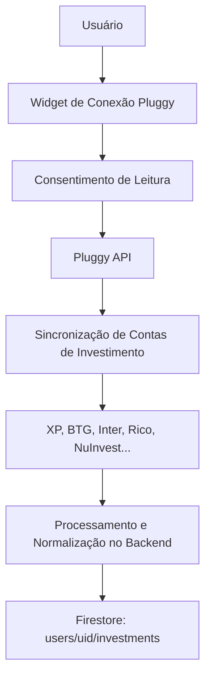

# ARQUITETURA DE INVESTIMENTOS EM LARGA ESCALA (NÍVEL INSTITUCIONAL)

> **Propósito:** Planejamento estratégico e arquitetura técnica para escalar o módulo de
> investimentos do Sibanki, superando as limitações da BRAPI e projetando um sistema
> autônomo com integrações automatizadas de corretoras, exchanges, análise fundamentalista
> científica (Graham, Bazin, Piotroski) e monitoramento on-chain.

---

## 1. O Diagnóstico das Limitações Atuais (BRAPI & Registro Manual)

Hoje, a BRAPI serve como um provedor de cotações básico, mas carece de robustez institucional:
- **Instabilidade e Cotas**: A API da BRAPI possui limites de requisição restritos e expira com frequência, prejudicando a sincronização em tempo real de grandes volumes de usuários.
- **Fundamentalismo Raso**: Fornece apenas indicadores brutos superficiais (P/L e DY do último ano), sem histórico de balanços trimestrais padronizados, fluxo de caixa livre ou histórico de dividendos de longo prazo.

### 💡 A Solução de Negócio Gigante:
Migrar a fonte primária de dados para um pipeline híbrido de dados de mercado:
1. **Financial Modeling Prep (FMP) / Alpha Vantage / Twelve Data**: Para dados fundamentalistas globais profundos, balanços patrimoniais padronizados (F10/DRE trimestrais) e cotações de mercado secundário de B3, ADRs e criptomoedas.
2. **TradingView Lightweight Charts (Client-side)**: Integração visual direta via widget no frontend para gráficos de análise técnica avançados, eliminando processamento de séries temporais de dados no nosso servidor.

---

## 2. Integração de Corretoras (Open Finance Fase 4)

O registro manual de ativos gera atrito e leva à inatividade da ferramenta. A evolução do Sibanki exige automação total.



### Implementação de Investimentos via Pluggy:
A Pluggy (que já está integrada para contas e cartões) oferece o endpoint `/investments` para consolidação automática de carteiras.
- **Fluxo Técnico**:
  - A Cloud Function `pluggySyncAccounts` lê a coleção de investimentos do usuário.
  - Normaliza os ativos em renda fixa (CDB, LCI, LCA, Debêntures) com suas respectivas taxas de rentabilidade (ex: % do CDI) e renda variável (Ações, FIIs, ETFs).
  - Atualiza as posições no Firestore automaticamente a cada 24 horas ou sob demanda do usuário.

---

## 3. Integração de Criptoativos (Exchanges & Wallet Tracker On-Chain)

Investidores de alta renda e jovens adultos demandam consolidação automatizada de criptoativos sem atrito.

### Método A: Integração via APIs de Exchanges (Binance, Mercado Bitcoin, Coinbase)
- O usuário insere uma chave de API **Read-Only** (Somente Leitura) gerada na exchange.
- A nossa Cloud Function consome periodicamente as posições do usuário, atualizando os saldos da carteira no Firestore.

### Método B (Inovador): Rastreamento de Endereços Públicos (On-Chain Tracker)
- O usuário não fornece chaves de API, apenas cadastra os endereços públicos de suas carteiras (Bitcoin, Ethereum, Solana, Metamask, etc.).
- O backend consome APIs indexadoras de Blockchain (como **DeBank API**, **Zapper API** ou **Etherscan/Solscan**):
  - Rastreia os saldos em tempo real de moedas nativas e tokens (ERC-20, BEP-20, SPL).
  - Identifica posições de DeFi (liquidez provida em pools, empréstimos em Aave, staking).
  - Fornece precificação automatizada em dólar/real via CoinGecko API.

---

## 4. O Motor Fundamentalista de Soberania (Graham, Bazin, Piotroski e Dupont)

Para superar portais como Investing.com, o Sibanki não deve apenas exibir números brutos (como P/L ou P/VP), mas sim calcular vereditos automatizados que traduzem a saúde da empresa para a soberania do investidor.

```
                  +-----------------------------------+
                  |   FMP API / Provedor de Dados     |
                  +-----------------+-----------------+
                                    |
                                    v
                  +-----------------+-----------------+
                  |     Motor de Inteligência B3      |
                  +-----------------+-----------------+
                                    |
            +-----------------------+-----------------------+
            |                       |                       |
            v                       v                       v
  +---------+---------+   +---------+---------+   +---------+---------+
  |  Preço Justo de   |   |   Preço Teto de   |   |    Piotroski      |
  |  Benjamin Graham  |   |    Décio Bazin    |   |     F-Score       |
  +---------+---------+   +---------+---------+   +---------+---------+
            |                       |                       |
            +-----------------------+-----------------------+
                                    |
                                    v
                  +-----------------+-----------------+
                  |     Arquiteto Soberano (IA)       |
                  |  Veredito e Alocação Sugerida     |
                  +-----------------------------------+
```

### A. Preço Justo de Benjamin Graham (Fórmula de Graham)
$$VI = \sqrt{22.5 \times LPA \times VPA}$$
- **LPA**: Lucro por Ação / **VPA**: Valor Patrimonial por Ação.
- O sistema calcula automaticamente o Valor Intrínseco (VI) do ativo e o compara com a cotação de mercado, exibindo a **Margem de Segurança %** (ex: *"Esta ação está sendo negociada com 30% de desconto sobre o valor intrínseco"*).

### B. Preço Teto de Décio Bazin (Foco em Dividendos)
$$Preço\ Teto = \frac{Média\ de\ Dividendos\ dos\ últimos\ 3\ anos}{0.06}$$
- Exige que o Dividend Yield mínimo seja de 6% ao ano, com endividamento saudável (Dívida Líquida/EBITDA < 3x).
- O sistema sinaliza se o ativo está em "zona de compra de proventos" ou se está caro demais para estratégias de dividendos.

### C. F-Score de Piotroski (Solidez e Risco de Falência)
- Avaliação de 0 a 9 pontos com base em 9 critérios contábeis (rentabilidade, alavancagem, liquidez e eficiência operacional).
- O sistema bloqueia ou alerta o investidor caso ele registre compras de ativos com score inferior a 3 (risco severo de reestruturação judicial).

### D. Análise Dupont de Eficiência do ROE
- Quebra o Retorno sobre o Patrimônio Líquido (ROE) em 3 componentes: **Margem Líquida** (eficiência operacional), **Giro do Ativo** (eficiência de vendas) e **Alavancagem Financeira**.
- Explica de forma simples se o lucro da empresa vem de vendas eficientes ou de endividamento arriscado.

---

## 5. Próximos Passos na Arquitetura de Software (Roadmap Técnico)

1. **Camada de Adaptação de Dados**: Criar um arquivo `functions/services/market/marketDataSource.js` que implemente um padrão de projeto **Adapter** (ou Strategy). Se a chave da BRAPI falhar ou expirar, a fila automaticamente recorre ao provedor secundário (Twelve Data / FMP).
2. **Integração de Webhooks da Pluggy**: Implementar escutas de webhooks da Pluggy para atualizar posições de investimento a cada nova movimentação na corretora do usuário.
3. **Mapeamento Cripto no Firestore**: Criar a coleção `/users/{uid}/wallets` para armazenar endereços públicos de blockchain de forma independente de custódia.
